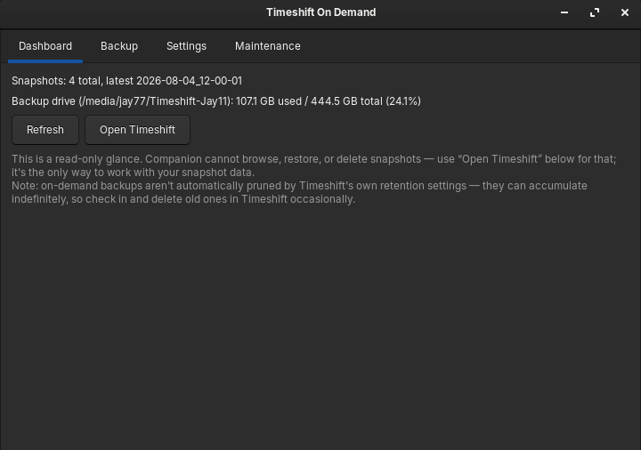
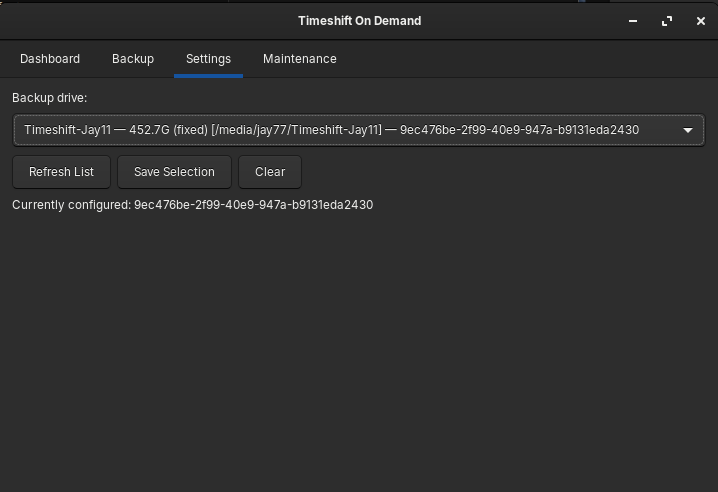

# Installation

## Requirements

- A Debian- or Ubuntu-based system (tested on Zorin OS 18.1 / Ubuntu 24.04).
- The official [`timeshift`](https://github.com/linuxmint/timeshift) package,
  GTK3 + Python 3 GObject introspection, `pkexec`/polkit, `zenity`,
  `libnotify-bin`. **All of these, including `timeshift` itself, are
  declared `.deb` dependencies** — installing the package pulls all of
  them in automatically, there's nothing to install separately first. A
  tray icon additionally needs `gir1.2-ayatanaappindicator3-0.1` (or the
  legacy `gir1.2-appindicator3-0.1`) — without either, the app still
  runs, just without a tray icon.

## Before you install: set up Timeshift itself first

This is the single most common source of confusion, so it gets said up
front: **Companion does not configure Timeshift.** It's a companion, not
a replacement — Timeshift needs to already know where to back up to
before Companion's "Backup Now" button can do anything.

If you haven't used Timeshift on this machine yet:

1. Open Timeshift itself (search your application menu, or run
   `timeshift-launcher`).
2. Go through its own first-run setup — snapshot type (RSYNC is the
   common choice), and crucially, **pick a backup device**.
3. Optionally configure its own Schedule tab (Daily/Weekly/Monthly/
   etc.) if you want scheduled backups *in addition to* on-demand ones
   — Companion is designed to work alongside Timeshift's own scheduling,
   not fight it. See [usage.md](usage.md#maintenance-tab) for how the
   Maintenance tab handles this.

Once Timeshift itself has a backup device configured, Companion is ready
to use.

## Building and installing the package

No published release yet — build from source:

```bash
sudo apt build-dep .          # or install debhelper/dpkg-dev manually
dpkg-buildpackage -us -uc -b
```

This produces `../timeshift-on-demand_<version>_all.deb` (one directory
above the source tree — normal `dpkg-buildpackage` convention).

Install it:

```bash
sudo apt install ../timeshift-on-demand_<version>_all.deb
```

**If you're upgrading an existing install**, use `apt install`/
`apt install --reinstall` from a terminal rather than a file manager's
"Install Application" right-click action — in testing, that GUI action
didn't reliably recognize a newer version was available and could
silently no-op instead of upgrading. Check afterward with:

```bash
dpkg -l timeshift-on-demand
```

The `Version` column should match what you just built.

## First launch

Launch Companion from your application menu ("Timeshift On Demand"), or
from a terminal:

```bash
timeshift-on-demand
```

It opens on the **Dashboard** tab:



Before anything else, go to **Settings** and pick your backup drive:



This is Companion's *own* setting — which drive it should wait for
before attempting a backup. It's independent of Timeshift's own
configured device (see [installation](#before-you-install-set-up-timeshift-itself-first)
above) — both need to point at the same drive for a backup to actually
succeed. If they don't match, Companion tells you clearly rather than
attempting a doomed backup — see
[troubleshooting.md](troubleshooting.md#timeshift-is-configured-to-back-up-to-a-different-device)
if you hit that.

## Auto-prompts (optional, on by default)

Two things are installed automatically and don't need separate setup:

- A **login prompt** — a `zenity` Yes/No dialog asking whether to run an
  on-demand backup, shown once per login/session start.
- A **resume-from-suspend prompt** — the same dialog, shown after
  waking from suspend.

Both are entirely independent of whether the Companion window or tray
icon is open. If you don't want either, they can be disabled through
your desktop environment's own "Startup Applications" settings (for the
login prompt) — see [usage.md](usage.md#auto-prompts-login-and-resume)
for more on how these work.

## Verifying the install

```bash
dpkg -l timeshift-on-demand              # package status = ii
which timeshift-on-demand                # /usr/bin/timeshift-on-demand
pkaction --action-id org.timeshiftondemand.app.backup   # confirms polkit picked up the policy
```

If the tray icon doesn't appear after launching, that's expected on
desktop environments without an AppIndicator extension installed — the
app still works fully from its main window.
