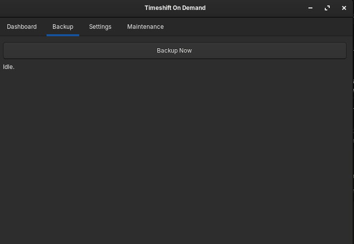
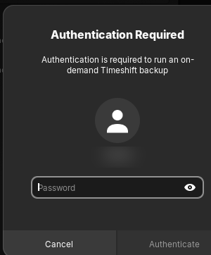
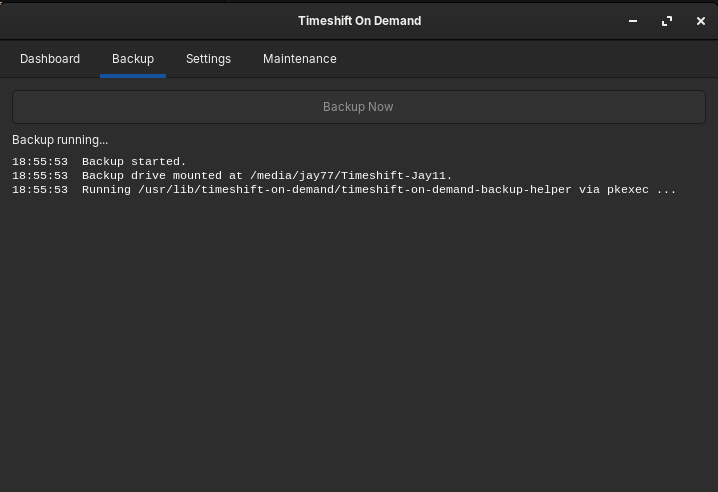
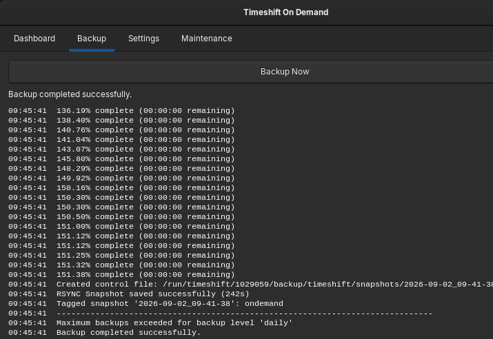
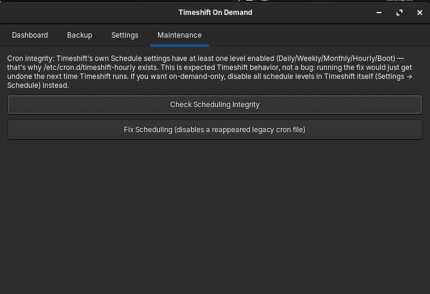

# Usage guide

Companion has four tabs, a tray icon, and two optional auto-prompts.
This walks through all of them.

## Dashboard tab

A read-only glance:

- **Snapshots** — total count and the latest tag, read via a privileged
  (`pkexec`) call to Timeshift — see
  [Understanding privilege prompts](#understanding-privilege-prompts)
  below for why this needs authentication at all.
- **Backup drive** — usage of whichever drive is configured in Settings,
  if it's currently mounted.
- **Refresh** / **Open Timeshift** — Refresh re-fetches both; Open
  Timeshift launches the real Timeshift GUI for anything beyond this
  glance.

The advisory text under the buttons is worth reading once: Companion
cannot browse, restore, or delete snapshots, and on-demand backups
aren't automatically pruned by Timeshift's own retention settings — see
[troubleshooting.md](troubleshooting.md#on-demand-snapshots-keep-piling-up)
if that becomes relevant.

The Dashboard does **not** auto-refresh the snapshot count on a timer —
only Refresh, opening the app, and a successful backup trigger it. This
is deliberate: it's a privileged call each time, and refreshing silently
every 30 seconds would mean repeated authentication prompts just for
having the window open.

## Backup tab

Click **Backup Now** to trigger an on-demand backup immediately — no
time-of-day restriction, works any time the configured drive is
mounted.

A `polkit` authentication dialog appears next — enter your password (or
use fingerprint/PIN if your system supports it) to actually authorize
the backup. See
[Understanding privilege prompts](#understanding-privilege-prompts)
below for why this is asked separately from your login password.

While running, the button disables and the status line updates. The log
below streams what actually happened — useful for diagnosing a failure
without needing to go find a log file. (Note: this in-app log shows
everything once the privileged step finishes, not incrementally line by
line the way the standalone monitor window does — see
[Auto-prompts](#auto-prompts-login-and-resume) below for that one.)

A completed run shows the outcome and the drive gets a fresh snapshot in
Timeshift.

## Settings tab

Pick which drive Companion should wait for before attempting a backup.
The dropdown lists currently-detected drives with a filesystem — pick
yours, click **Save Selection**. **Clear** removes the configured drive
entirely (Companion will then decline to run a backup until one is set
again, rather than guessing).

This setting is **independent of Timeshift's own configured backup
device** — see
[installation.md](installation.md#first-launch) and
[troubleshooting.md](troubleshooting.md#timeshift-is-configured-to-back-up-to-a-different-device)
for why both need to match.

## Maintenance tab

Checks whether a legacy `/etc/cron.d/timeshift-hourly` file has
reappeared, and explains why:

- **If Timeshift's own Schedule settings have anything enabled**
  (Daily/Weekly/Monthly/Hourly/Boot), the message above is what you'll
  see — the cron file existing is expected, not a bug, and the fix
  button deliberately refuses to run (it would just get undone the next
  time Timeshift's own scheduler runs).
- **If Timeshift's scheduling is entirely off** and the file still
  exists, that *is* a genuine anomaly — the check reports it as such,
  and "Fix Scheduling" actually disables the reappeared file in that
  case.

The **Fix Scheduling** button itself doesn't visually change between
these two cases — it stays clickable either way. In the first case
(shown above), clicking it is harmless but does nothing; read the
check message above the button to know which case you're in before
expecting it to act. See
[troubleshooting.md](troubleshooting.md#maintenance-tabs-fix-scheduling-button-does-nothing--says-not-applied)
if the button not visibly reacting had you thinking something was
broken.

Companion is designed to work correctly whether or not you use
Timeshift's own scheduling alongside it — this tab is what makes that
distinction instead of blindly fighting anything it finds.

## Tray icon

If your desktop environment supports AppIndicator (most GNOME-based
ones do, with the right extension), Companion runs a tray icon with:

- **Backup Now** — same as the Backup tab's button.
- **Show Window** — brings the main window back (closing the window
  hides it rather than quitting, precisely so the tray/auto-prompts keep
  working).
- **Quit** — actually exits.

## Auto-prompts (login and resume)

Independent of the main window entirely — these fire even if Companion
was never manually opened:

1. A `zenity` Yes/No dialog: *"Do you want to start the on-demand
   Timeshift backup now?"*
2. On **Yes**, a small standalone monitor window opens, streaming the
   backup's progress live, line by line, as it happens — genuinely
   incremental, unlike the in-app Backup tab's log.
3. It auto-closes a few seconds after a successful finish, or stays
   open until you close it if the backup failed.
4. A desktop notification also appears either way, independent of
   whether you're watching the window.

If the drive isn't mounted when either trigger fires, none of this
appears at all — it waits briefly, then quietly gives up. See
[troubleshooting.md](troubleshooting.md#the-loginresume-prompt-didnt-appear)
if you expected it to show and it didn't.

## Understanding privilege prompts

You'll be asked to authenticate (password/fingerprint, via `polkit`) for
three specific things, each separately and narrowly scoped — Companion
itself never runs as root:

| When | What | How often |
|---|---|---|
| Clicking "Backup Now" / auto-prompt confirm | Creating the actual snapshot | Every time |
| Clicking "Fix Scheduling" | Disabling a reappeared legacy cron file | Every time |
| Opening the app / clicking Refresh / after a successful backup | Reading the snapshot list | Cached briefly, so rapid repeat clicks shouldn't re-prompt |

This is deliberate — Companion depends on `polkit` for authorization
rather than a standing passwordless grant, so every privileged action
genuinely requires you to say yes each time (except the read-only list
action, which caches briefly). See the top-level `README.md`'s
"Privilege model" section for the full reasoning.
